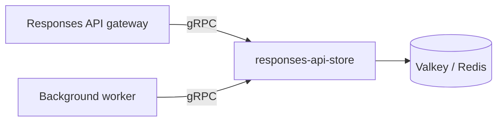

# responses-api-store

gRPC service for managing OpenAI Responses API compatible request state: storing response objects, tracking background jobs, and distributing work to background workers.

Designed as a shared dependency for Kubernetes-deployed services such as [beranekio/duihua-ai-services](https://github.com/beranekio/duihua-ai-services).

## Features

- Persist Responses API objects and materialized conversation input in Valkey/Redis
- Enqueue and claim `background=true` jobs via a Redis stream consumer group
- Reconcile stale queued responses to `failed`
- Tombstone in-flight background deletions instead of hard-deleting active jobs
- Rust and Go client SDKs generated from the same protobuf contract

## Architecture



Gateway services call the store when creating, retrieving, deleting, or enqueueing responses. Background workers claim jobs from the store, execute upstream inference, and write completed responses back.

## gRPC API

Protobuf definition: [`proto/responsesapistore/v1/store.proto`](proto/responsesapistore/v1/store.proto)

| RPC | Purpose |
| --- | --- |
| `StoreResponse` | Persist a stored response record |
| `GetResponse` | Load a record, optionally reconciling stale queued jobs |
| `UpdateResponse` | Replace a stored record |
| `DeleteResponse` | Delete or tombstone a record |
| `EnqueueBackgroundJob` | Store a queued record and publish it to the background stream |
| `ClaimBackgroundJobs` | Claim jobs for worker processing (`XREADGROUP` + `XAUTOCLAIM`); may return `pending_stream_ids` when record load fails transiently |
| `AcknowledgeBackgroundJob` | Acknowledge successful job processing |
| `EnsureConsumerGroup` | Bootstrap the Redis stream consumer group |
| `ReconcileStaleResponse` | Mark stale queued responses as `failed` |
| `GenerateResponseId` | Allocate a new `resp_*` identifier |
| `Health` | Report service and Redis connectivity |

## Repository layout

```
proto/                         # Canonical protobuf definitions
crates/
  proto/                       # Generated Rust protobuf + tonic stubs
  core/                        # Valkey storage and queue implementation
  server/                      # gRPC server binary
  client/                      # Rust client SDK
sdk/go/                        # Go protobuf stubs and client SDK
charts/responses-api-store/    # Helm subchart
```

## Configuration

| Environment variable | Default | Description |
| --- | --- | --- |
| `GRPC_LISTEN_ADDR` | `0.0.0.0:50051` | gRPC bind address |
| `GRPC_MAX_MESSAGE_BYTES` | `67108864` (64 MiB) | Max gRPC send/recv message size |
| `RESPONSE_ID_STORE_URL` | `redis://valkey:6379` | Valkey/Redis URL |
| `RESPONSE_ID_STORE_KEY_PREFIX` | `responses-api-store:responses` | Key prefix for stored responses |
| `RESPONSE_ID_STORE_TTL_SECONDS` | `86400` | Default TTL for stored responses |
| `BACKGROUND_QUEUE_STREAM_KEY` | `responses-api-store:background` | Redis stream key for background jobs |
| `BACKGROUND_QUEUE_STREAM_MAXLEN` | `10000` | Approximate max stream length (`XADD MAXLEN ~`); `0` disables trimming |
| `BACKGROUND_RESPONSE_STALE_SECONDS` | `3600` | Stale threshold for queued background responses |

## CI

GitHub Actions workflow [`.github/workflows/validate.yml`](.github/workflows/validate.yml) runs on pushes and pull requests to `main`:

- Rust formatting, clippy, and unit tests
- Go tests and verification that generated protobuf stubs match `proto/`
- Helm chart lint and template rendering
- Dockerfile lint (hadolint) and image build
- Integration smoke test against a Valkey service container
- Helm chart smoke test on kind (chart install + Rust smoke example)

Run the same checks locally:

```bash
make ci
```

## Local development

### Run the server

```bash
# Start Valkey locally
docker run --rm -p 6379:6379 valkey/valkey:8.0

# Run the gRPC server
cargo run -p responses-api-store-server
```

### Rust client

```toml
responses-api-store-client = { path = "../responses-api-store/crates/client" }
```

```rust
use responses_api_store_client::Client;

let mut client = Client::connect("http://127.0.0.1:50051").await?;
let health = client.health().await?;
```

### Go client

```go
import "github.com/beranekio/responses-api-store/sdk/go/client"

cli, err := client.Dial(ctx, "127.0.0.1:50051")
```

Regenerate Go stubs after proto changes:

```bash
./scripts/generate-go.sh
```

## Docker

```bash
docker build -t responses-api-store:local .
docker run --rm -p 50051:50051 \
  -e RESPONSE_ID_STORE_URL=redis://host.docker.internal:6379 \
  responses-api-store:local
```

## Helm

The chart can run standalone or as a subchart. By default it deploys an embedded Valkey instance for local development and smoke testing.

**Bundled Valkey is ephemeral by default:** the subchart disables RDB/AOF persistence and does not mount a PVC, so pod restarts or reschedules permanently lose stored responses, stream entries, and consumer-group state. For production, disable bundled Valkey and use external Redis/Valkey with persistence. For single-node installs that should survive restarts, enable optional bundled persistence:

```yaml
valkey:
  persistence:
    enabled: true
    size: 1Gi
```

**gRPC port alignment:** set `grpc.port` (default `50051`) as the canonical listener port. The chart derives `containerPort`, Service port, and `GRPC_LISTEN_ADDR` (`0.0.0.0:<port>`) from it unless `grpc.listenAddr` is set explicitly.

**Readiness:** the chart runs `/responses-api-store-probe`, which calls the `Health` RPC and fails when `redis_ok` is false. Liveness remains a TCP check on the gRPC port.

```bash
helm install responses-api-store ./charts/responses-api-store
```

Disable bundled Valkey and point at an external Redis-compatible store:

```yaml
valkey:
  enabled: false
redis:
  url: redis://shared-valkey:6379
```

For parent charts such as `duihua-ai-services`, add a dependency and set gateway/worker environment variables to the release gRPC endpoint:

```yaml
# values.yaml excerpt
responsesApiStore:
  enabled: true
  endpoint: responses-api-store:50051
```

## Stored record shape

The service stores the same record shape used by `duihua-ai-services`:

```json
{
  "upstream": "http://inference:8000/v1",
  "response": { "id": "resp_...", "status": "queued", "background": true },
  "input": [{ "role": "user", "content": "hello" }],
  "pending_upstream_request": { "model": "demo", "input": "hello", "store": false },
  "upstream_authorization": "Bearer ...",
  "enqueued_at": 1746500000
}
```

## License

MIT